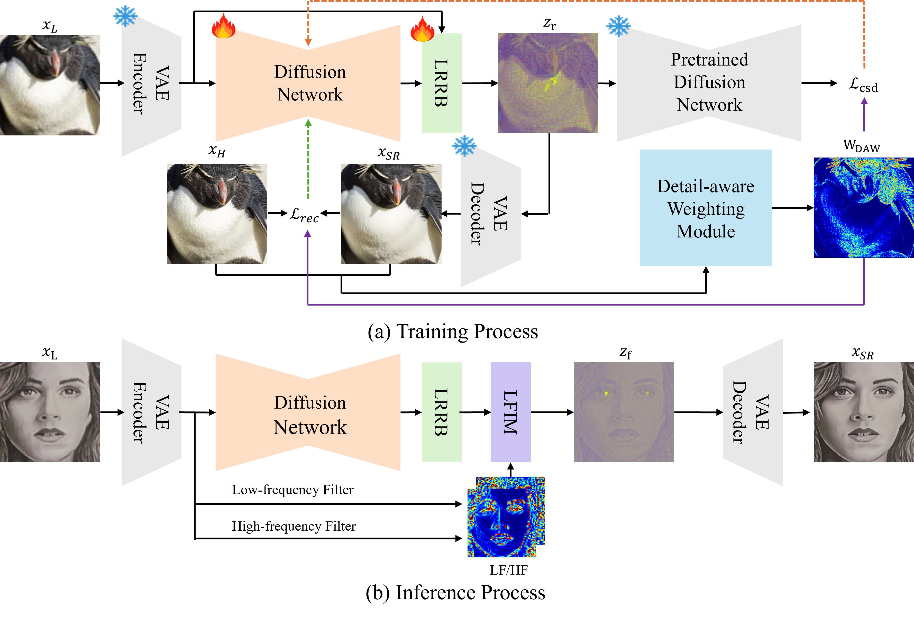
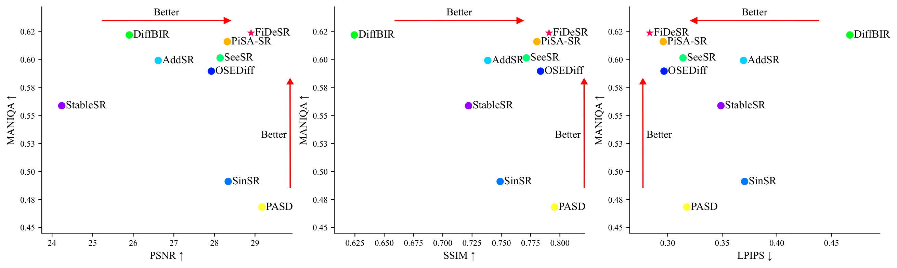

# FiDeSR: High-Fidelity and Detail-Preserving One-Step Diffusion Super-Resolution

<p align="center">
  <a href="https://arxiv.org/abs/2603.02692">
    
  </a>
    <a href="https://diffusion-sr.github.io/FiDeSR/"></a>
</p>
<p align="center">
  ⭐ <b>Accepted by CVPR 2026</b>
</p>


## 🔥 News
- **CVPR 2026 Accepted**
- **[2026.03] arXiv preprint:** [arXiv:2603.02692](https://arxiv.org/abs/2603.02692)
- **[2026.04] Code and pretrained model are released** (training / inference / pretrained models).

## 📌 Framework
<p align="center">
  
</p>

## ⚙️ Dependencies & Installation
```bash
git clone https://github.com/Ar0Kim/FiDeSR.git
cd FiDeSR

conda create -n fidesr python=3.10
conda activate fidesr

pip install -r requirements.txt
```


## ⚡ Quick Inference

### Step 1: Download the Pretrained Models

Download the following models:

| Model | Description | Link |
|---|---|---|
| SD 2.1-base | Base diffusion model | [Stable Diffusion 2.1-base](https://huggingface.co/Manojb/stable-diffusion-2-1-base) |
| RAM | Recognize Anything Model (for tagging) | [ram_swin_large_14m.pth](https://huggingface.co/spaces/xinyu1205/recognize-anything/blob/main/ram_swin_large_14m.pth) |
| FiDeSR | FiDeSR checkpoint (LoRA + LRRB weights) | [fidesr.pkl](https://huggingface.co/jmjin2/FiDeSR/tree/main) |

### Step 2: Prepare the StableSR test datasets
Download StableSR testsets from [HuggingFace](https://huggingface.co/datasets/Iceclear/StableSR-TestSets/tree/main).

### Step 3: Run Inference

```bash
python test_fidesr.py \
  --pretrained_model_path preset/models/stable-diffusion-2-1-base \
  --pretrained_path preset/models/fidesr.pkl \
  --process_size 512 \
  --upscale 4 \
  --input_image preset/test_datasets \
  --output_dir experiments/test \
  --hf_scale 0.3 \
  --lf_scale 0
```

## 🖼️ Results
### Trade-off Comparison
FiDeSR achieves the best trade-off between fidelity (PSNR↑, SSIM↑, LPIPS↓) and perceptual quality (MANIQA↑) among existing methods including DiffBIR, PiSA-SR, SeeSR, AddSR, OSEDiff, StableSR, SinSR, and PASD.
<p align="center">
  
</p>

### Visual Comparison
<p align="center">
  
  
</p>

## License
This project is released under the Apache 2.0 license.

## Citations
```bash
@article{kim2026fidesr,
  title={FiDeSR: High-Fidelity and Detail-Preserving One-Step Diffusion Super-Resolution},
  author={Kim, Aro and Jang, Myeongjin and Moon, Chaewon and Shin, Youngjin and Jeong, Jinwoo and Park, Sang-hyo},
  journal={arXiv preprint arXiv:2603.02692},
  year={2026}
}
```